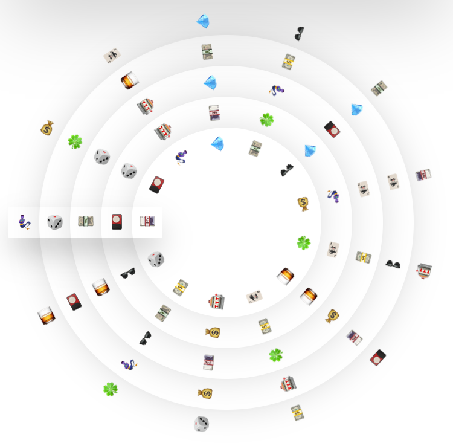

	

<h1 align="center">Blockstack Casino</h1>
 

A blockchain roulette casino game. Can you beat your hi-score?

## Try it out!

<a target="_blank" href="https://blockstackcasino.com/">https://blockstackcasino.com/</a>

You'll need to authenticate with a blockstack account (an open-source blockchain framework for building decentralized apps and smart contracts) in order to track your score.

Scores are saved and preserved on blockstack distributed data storage. Each time the hi-score is updated, the score gets posted back on the underlying blockchain.

## Running Blockstack Casino locally

Clone the project

1. Update `manifest.json` `start_url` to `localhost:8080`
2. `yarn`
3. `yarn start`

The web app should now be available on `localhost:8080/index.html`
